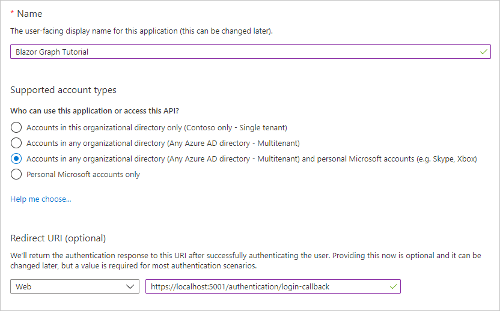

# <a name="how-to-run-the-completed-project"></a>Vorgehensweise Ausführen des abgeschlossenen Projekts

## <a name="prerequisites"></a>Voraussetzungen

Um das abgeschlossene Projekt in diesem Ordner auszuführen, benötigen Sie Folgendes:

- Das [.net Core SDK](https://dotnet.microsoft.com/download) , das auf Ihrem Entwicklungscomputer installiert ist. (**Hinweis:** dieses Lernprogramm wurde mit .net Core SDK Version 3.1.402 geschrieben. Die Schritte in diesem Leitfaden funktionieren möglicherweise mit anderen Versionen, aber das wurde nicht getestet.)
- Entweder ein persönliches Microsoft-Konto mit einem Postfach auf Outlook.com oder ein Microsoft-Arbeits-oder Schulkonto.

Wenn Sie kein Microsoft-Konto haben, gibt es mehrere Optionen, um ein kostenloses Konto zu erhalten:

- Sie können [sich für ein neues persönliches Microsoft-Konto registrieren](https://signup.live.com/signup?wa=wsignin1.0&rpsnv=12&ct=1454618383&rver=6.4.6456.0&wp=MBI_SSL_SHARED&wreply=https://mail.live.com/default.aspx&id=64855&cbcxt=mai&bk=1454618383&uiflavor=web&uaid=b213a65b4fdc484382b6622b3ecaa547&mkt=E-US&lc=1033&lic=1).
- Sie können sich [für das Office 365 Entwicklerprogramm registrieren](https://developer.microsoft.com/office/dev-program) , um ein kostenloses Office 365-Abonnement zu erhalten.

## <a name="register-a-web-application-with-the-azure-active-directory-admin-center"></a>Registrieren einer Webanwendung im Azure-Active Directory Admin Center

1. Öffnen Sie einen Browser, und navigieren Sie zum [Azure Active Directory Admin Center](https://aad.portal.azure.com). Melden Sie sich mit einem **persönlichen Konto** (auch: Microsoft-Konto) oder einem **Geschäfts- oder Schulkonto** an.

1. Wählen Sie in der linken Navigationsleiste **Azure Active Directory** aus, und wählen Sie dann **App-Registrierungen** unter **Verwalten** aus.

    

1. Wählen Sie **Neue Registrierung** aus. Legen Sie auf der Seite **Anwendung registrieren** die Werte wie folgt fest.

    - Legen Sie **Name** auf `Blazor Graph Tutorial` fest.
    - Legen Sie **Unterstützte Kontotypen** auf **Konten in allen Organisationsverzeichnissen und persönliche Microsoft-Konten** fest.
    - Legen Sie unter **Umleitungs-URI** die erste Dropdownoption auf `Web` fest, und legen Sie den Wert auf `https://localhost:5001/authentication/login-callback` fest.

    

1. Wählen Sie **Registrieren** aus. Kopieren Sie auf der Seite " **Blazer Graph Tutorial** " den Wert der **Anwendungs-ID (Client)** , und speichern Sie Sie, um Sie im nächsten Schritt zu benötigen.

    

1. Wählen Sie unter **Verwalten** die Option **Authentifizierung** aus. Suchen Sie den **impliziten Grant** -Abschnitt, und aktivieren Sie **Zugriffstoken** und **ID-Token**. Wählen Sie **Speichern** aus.

## <a name="configure-the-sample"></a>Konfigurieren des Beispiels

1. Benennen Sie die **/GraphTutorial/wwwroot/-appsettings.example.jsfür** die Datei in **appsettings.jsein**.

1. Bearbeiten Sie **appsettings.js** und ersetzen `YOUR_APP_ID_HERE` Sie Sie durch Ihre Anwendungs-ID.

## <a name="run-the-sample"></a>Ausführen des Beispiels

Führen Sie in der CLI den folgenden Befehl aus, um die Anwendung zu starten.

```Shell
dotnet run
```
